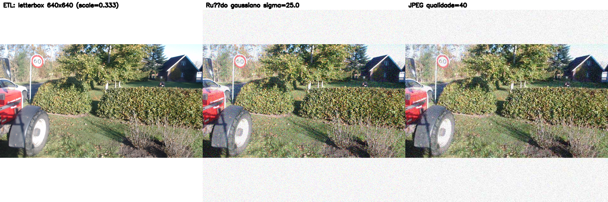

# Pipeline de Preparação — FieldSAFE RGB

Este pipeline prepara o subset RGB do FieldSAFE para os modelos YOLOv5, SegNet e Autoencoder.

## Uso na Pesquisa (Resumo)

- Download de dados: realizado manualmente via navegador autenticado, salvando os arquivos `.bag` no diretório `~/Área de Trabalho/TCC_FieldSAFE/`.
- Seleção de sensor: foco nas imagens RGB da webcam Logitech C920 (baixa custo), conforme diagrama e objetivo do trabalho.
- Detecção de tópico: apoio do `src/data/detect_webcam_topic.py` para identificar o tópico de imagem da webcam em cada `.bag`.
- Extração de frames: feita com `src/data/extract_rosbag.py` via Docker (ROS Noetic) para gerar `images/*.png` e `frames_manifest.csv` por sequência. Política reprodutível: amostragem `EVERY_N=10` para reduzir redundância temporal.
- Exploração e pré-processamento: realizados nos notebooks `notebooks/01_exploracao_fieldsafe_rgb.ipynb` e `notebooks/02_preprocessamento_rgb.ipynb`.

## Arquitetura do Projeto e Arquivos

- `pyproject.toml`: metadados do projeto Python (nome, versão, descrição) e configuração do empacotamento via `setuptools` apontando para `src`. Útil para instalar/empacotar e para ferramentas modernas reconhecerem o projeto.
- `requirements.txt`: lista de dependências Python. O alvo `make setup` instala essas dependências no venv `fieldsafe`.
- `Makefile`: atalhos para tarefas principais:
  - `setup` (instala dependências), `detect-webcam-topic` (sugere tópico da webcam em `.bag`), `docker-build` e `extract-webcam` (constroem imagem ROS Noetic e extraem frames).
- `docker/ros_noetic_extractor.Dockerfile`: imagem Docker com ROS Noetic (`rosbag`, `cv_bridge`) para rodar `extract_rosbag.py` isolado do ambiente local.
- `experiments/configs/dataset.yml`: arquivo de configuração do dataset (caminhos/variáveis) usado por scripts de validação e preparação.
- `notebooks/`: Jupyter Notebooks de exploração e pré-processamento (`01_exploracao_fieldsafe_rgb.ipynb`, `02_preprocessamento_rgb.ipynb`).
- `docs/`: materiais de apoio e relatórios.

### Scripts em `src/data`

- `detect_webcam_topic.py`: usa `rosbags` para listar tópicos de imagem em um `.bag` e sugerir o da webcam (`--quiet` imprime só o sugerido).
- `extract_rosbag.py`: extrai frames RGB de `.bag` para `images/*.png` e `frames_manifest.csv` (requer ROS `rosbag`+`cv_bridge`; recomendado via Docker).
- `preprocess_with_manifests.py`: pré-processa imagens (redimensionamento adaptativo, ruído, compressão) e gera `manifest.csv` por sequência com metadados para rastreabilidade.
- `prepare_rgb_subset.py`: organiza imagens/rotulagem para modelos (redimensiona, gera splits; opcionalmente converte máscara para YOLO).
- `prepare_fieldsafe_preprocessing.py`: utilitários para preparar dados RGB conforme convenções do projeto.
- `validate_preprocessing.py`: valida estrutura/consistência após preparação.
- `demonstrate_integration.py`: demonstra integração/uso rápido do pipeline.

### Ferramentas em `tools`

- `validate_dataset_yaml.py`: valida o `experiments/configs/dataset.yml` (chaves obrigatórias, tipos e caminhos), garantindo que o pipeline encontra os recursos.

## Requisitos

- Python 3.9+
- pacotes: `opencv-python`, `numpy`, `scikit-learn`

```bash
pip install opencv-python numpy scikit-learn
```

## Estrutura esperada (exemplo)

```
datasets/
  extract_rgb/
    seq01/images/...
    seq02/images/...
    ...
datasets/
  labels_semantic/           # opcional (máscaras PNG)
    seq01/labels/...
    seq02/labels/...
```

## Execução — Máscaras Semânticas

```bash
python3 prepare_rgb_subset.py \
  --rgb_root datasets/extract_rgb \
  --label_root datasets/labels_semantic \
  --outdir fieldsafe_rgb_ready \
  --resize 640 640 \
  --label_type semantic \
  --gen_yolo_from_mask
```

## Execução — Rótulos YOLO já prontos

```bash
python3 prepare_rgb_subset.py \
  --rgb_root datasets/extract_rgb \
  --label_root datasets/labels_yolo \
  --outdir fieldsafe_rgb_ready \
  --resize 640 640 \
  --label_type yolo
```

## Saídas

- `fieldsafe_rgb_ready/images/` — imagens padronizadas (640x640)
- `fieldsafe_rgb_ready/labels/` — labels compatíveis (máscara PNG ou .txt YOLO)
- `fieldsafe_rgb_ready/split/{train,val,test}/{images,labels}` — conjuntos finais
- `fieldsafe_rgb_ready/manifests/*.csv` — manifestos dos conjuntos
- `fieldsafe_rgb_ready/relatorio_summary.txt` — estatísticas e observações

## Curadoria e Rotulagem — Webcam Logitech C920

- Formatos: Detecção (YOLO, caixas 2D) e Segmentação (SegNet, máscaras PNG pixel-wise).
- Classes YOLO: `tractor`, `combine`, `trailer`, `combine header`, `baler`, `square bale`, `round bale`, `human`.
- Amostragem reprodutível: `EVERY_N=10` ao extrair frames das sequências da webcam para evitar redundância temporal devido à baixa velocidade do trator. Exemplos locais: `11-34-25` (≈6 min) → 728 frames; `11-41-21_example` (1 min) → 104 frames.
- Redação sugerida: “Para evitar redundância temporal devido à baixa velocidade do trator, aplicou-se amostragem `EVERY_N=10` nas sequências da webcam Logitech C920, produzindo um subconjunto balanceado de imagens com maior variabilidade visual e menor risco de sobreajuste.”

### Ferramenta de Anotação (sugestão)
- Label Studio via Docker:
  - `docker run -d --name labelstudio -p 8080:8080 -v "$HOME/Área de Trabalho/TCC_FieldSAFE/annotation_projects:/labelstudio/data" heartexlabs/label-studio:latest`
  - Projeto: “FieldSAFE Webcam — YOLO & SegNet”. Templates: “Image Bounding Boxes” e “Image Segmentation”. Classes conforme lista acima.
  - Importar `datasets/extract_rgb/<SEQ>/images` e anotar conforme guia.

### Guia de Anotação
- Critérios: boxes justos (sem excesso de contexto), lidar com oclusões, múltiplos objetos por frame, ignorar objetos irrelevantes.
- Revisão: amostragem de 10–15% para segunda leitura e consistência.
- QC automático: checar classes válidas, caixas dentro da imagem, máscaras com paleta/índices corretos.

### Exportação e Integração
- Detecção: exportar YOLO `.txt` por imagem (classe, x_center, y_center, width, height normalizados).
- Segmentação: exportar máscaras PNG indexadas.
- Preparação: usar `prepare_rgb_subset.py` com `--label_type yolo` ou `--label_type semantic` (opcional `--gen_yolo_from_mask`). Tamanho alvo: YOLO ≈ 12k–15k imagens; SegNet ≈ 800–900 imagens (estratificar por sequência/cena).

### Pré-processamento com Manifestos (rastreabilidade)
- YOLOv5 (tempo real): redimensionar para `640x640` com letterbox (`--keep_aspect`) e, opcionalmente, simular deterioração:
```bash
python3 src/data/preprocess_with_manifests.py \
  --rgb_root ~/Área\ de\ Trabalho/TCC_FieldSAFE/datasets/extract_rgb \
  --out_root ~/Área\ de\ Trabalho/TCC_FieldSAFE/datasets/preprocessed_yolo \
  --size 640x640 \
  --keep_aspect \
  --noise_type gaussian --noise_level 5.0 \
  --compress_type jpeg --quality 85 \
  --label_root ~/Área\ de\ Trabalho/TCC_FieldSAFE/datasets/labels_yolo
```
- SegNet (semântica): redimensionar para `1024x385` sem letterbox (`--keep_aspect` opcional) e preservar máscaras com `NEAREST`:
```bash
python3 src/data/preprocess_with_manifests.py \
  --rgb_root ~/Área\ de\ Trabalho/TCC_FieldSAFE/datasets/extract_rgb \
  --out_root ~/Área\ de\ Trabalho/TCC_FieldSAFE/datasets/preprocessed_segnet \
  --size 1024x385 \
  --noise_type none --compress_type png --quality 9 \
  --label_root ~/Área\ de\ Trabalho/TCC_FieldSAFE/datasets/labels_semantic
```
- Cada sequência recebe `manifest.csv` com: `seq, fname, out_path, label_path, noise_type, noise_level, compress_type, quality, keep_aspect, target_w, target_h`.

Validação rápida de rótulos referenciados nos manifestos:
```bash
python3 tools/validate_labels_against_manifests.py \
  --preprocessed_root ~/Área\ de\ Trabalho/TCC_FieldSAFE/datasets/preprocessed_yolo

python3 tools/validate_labels_against_manifests.py \
  --preprocessed_root ~/Área\ de\ Trabalho/TCC_FieldSAFE/datasets/preprocessed_segnet
```

### Contabilização Rápida
Para listar quantos frames por sequência já extraída:
```bash
for d in ~/Área\ de\ Trabalho/TCC_FieldSAFE/datasets/extract_rgb/*; do
  test -d "$d/images" || continue
  seq=$(basename "$d"); cnt=$(ls -1 "$d/images"/*.png 2>/dev/null | wc -l)
  echo "$seq,$cnt"
done
```

## Notas

- A divisão 70/15/15 usa GroupShuffleSplit por sequência (evita vazamento).
- Para máscaras, a interpolação é `NEAREST` para não “borrar” rótulos.
- A opção `--gen_yolo_from_mask` cria .txt YOLO por componentes conectados.

## Manifesto por Imagem — Campos e Interpretação

Cada execução didática (`trace_etl_single.py`) gera um `*_trace_manifest.csv` com:

- `orig_w`, `orig_h`: largura/altura originais da imagem.
- `target_w`, `target_h`: tamanho alvo após ETL (ex.: 640x640 ou 1024x385).
- `scale`: fator de escala aplicado antes do letterbox ($scale = \min(\frac{target_w}{orig_w}, \frac{target_h}{orig_h})$).
- `new_w`, `new_h`: dimensões após o resize mantendo aspecto ($new_w = orig_w \times scale$, $new_h = orig_h \times scale$).
- `x_off`, `y_off`: offsets do letterbox ao centralizar a imagem redimensionada dentro do canvas alvo.
- `noise_sigma`: sigma do ruído gaussiano aplicado (0 se não aplicável).
- `jpeg_quality`: qualidade usada na compressão JPEG (maior = menos artefatos).
- `label_path`: caminho do rótulo associado (YOLO `.txt` ou máscara PNG). Vazio se não informado.
- `letterbox_path`, `noisy_path`, `jpeg_path`, `stages_side_by_side_path`: caminhos dos artefatos gerados.

Exemplos práticos gerados localmente em `datasets/trace_demo/`:
- YOLO: `rgb_1477386583133442258_*` (com `label_path` para `.txt`).
- SegNet: `rgb_1477386583133442258_segnet_*` (com `label_path` para máscara `.png`).

Visualização lado a lado (ETL → Ruído → JPEG):



## Demonstração Didática: ETL + Degradação + Visualização por Imagem

Para fins didáticos, é possível traçar uma imagem individual pelos estágios de ETL (letterbox), ruído gaussiano e compressão JPEG, salvando um manifesto por imagem e uma visualização dos três estágios lado a lado.

```bash
# Defina caminhos conforme sua máquina
IMG="/home/osvaldo/Área de Trabalho/TCC_FieldSAFE/datasets/extract_rgb/2016-10-25-11-09-42/images/rgb_1477386583133442258.png"
OUTDIR="/home/osvaldo/Área de Trabalho/TCC_FieldSAFE/datasets/trace_demo"
SEQ="2016-10-25-11-09-42"
IMAGE_ID="rgb_1477386583133442258"

/home/osvaldo/.venvs/fieldsafe/bin/python \
  "/home/osvaldo/Área de Trabalho/TCC_FieldSAFE/tcc-fieldsafe-data/src/data/trace_etl_single.py" \
  "$IMG" "$OUTDIR" "$SEQ" "$IMAGE_ID" "" \
  --size 640x640 --noise 5.0 --jpeg 85

ls -la "$OUTDIR"
```

Saídas em `$OUTDIR`:
- `*_letterbox.png`: resultado do ETL com letterbox.
- `*_noisy.png`: imagem com ruído gaussiano.
- `*_compressed.jpg`: imagem comprimida em JPEG.
- `*_stages_side_by_side.png`: visualização dos três estágios lado a lado.
- `*_trace_manifest.csv`: manifesto por imagem com parâmetros (tamanho original, escala, offsets, sigma de ruído, qualidade JPEG) e caminhos.
